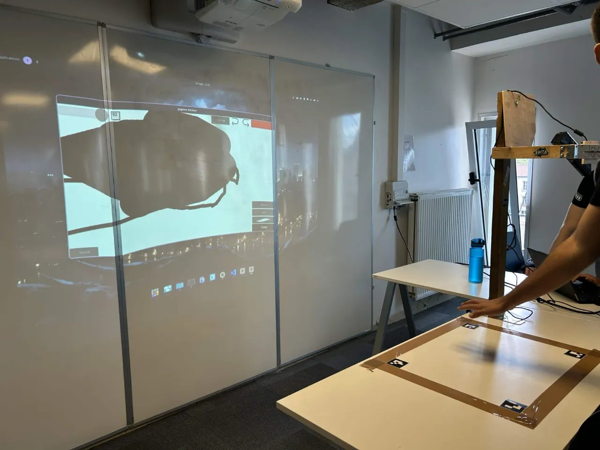
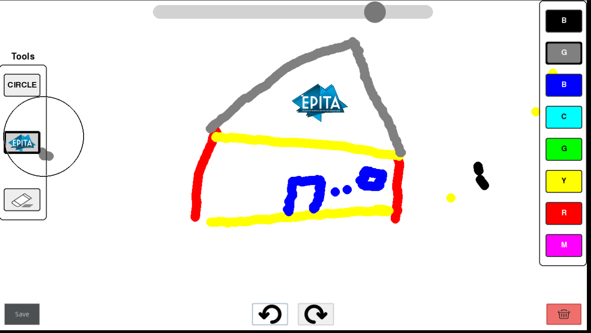

# Minimou

Draw with your finger on a table and watch your drawing appear on a wall. An interactive, Paint-like app controlled by a Kinect, with no touchscreen and no mouse.



## Highlights

- **Finger tracking with a Kinect**: the index finger drives the drawing, and touching the table draws
- **Automatic calibration** of the drawing zone using 4 ArUco markers
- **Paint-like interface**: color palette, eraser, shapes, undo / redo, clear and save, all selectable with your finger
- **One-command launch** with Docker, reproducible dev environment with Nix



## How it works

1. A rectangle taped on a table, with a marker in each corner, defines the drawing zone. It is calibrated automatically.
2. The **Kinect module** (C++) sends each frame to the **Image Processing module** (Python) that tracks the user's hand and index finger, and detects whether it touches the table.
3. The **Python app** (`canvas_loop/`) maps the fingertip to the canvas: touching the table draws, hovering moves the cursor, and pressing on a button selects it.
4. The canvas is projected on a board in front of the user.

**Stack:** C++ · OpenCV · libfreenect · CMake · Python · PyGame · uv · Docker · Nix

## Quick start

```bash
git clone https://github.com/Zarvork/minimou.git
cd minimou
./start.sh    # requires Docker
```

A Kinect, a projector and a table with the 4 markers are needed.

## Limitations

- Finger detection is sensitive: fast movements and spread fingers can cause errors
- Calibration sensitivity can be improved
- Single user only.

## Authors

- Anis Feore
- Lucil Finkelstein
- Roman Miralves
- Johan Emmanuelli
- Alexis Meunier
- Axel Gil
- Julien Marnet
- Martin Boulanger
